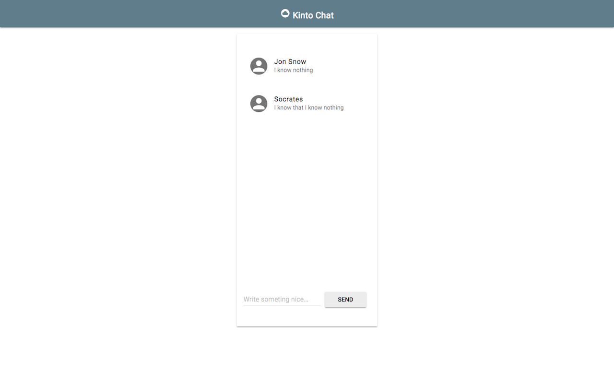
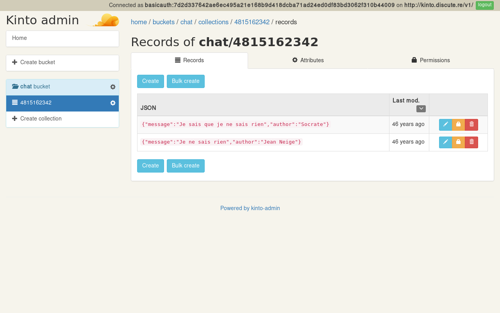
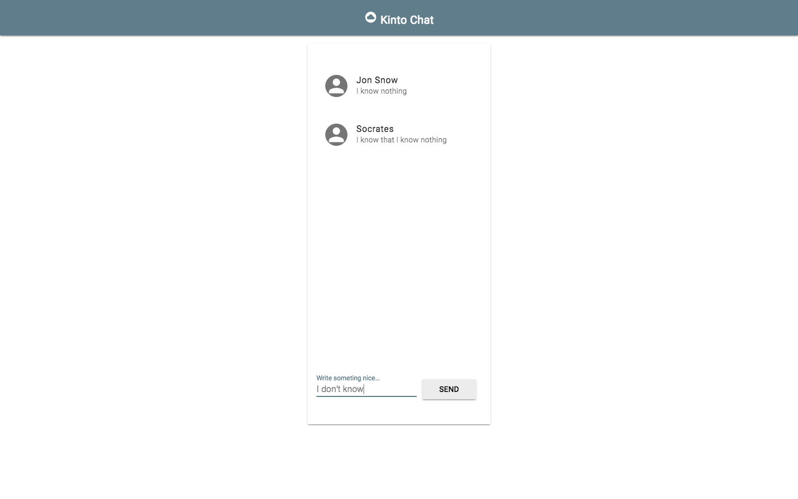

Title: How to develop a WebApp with Kinto
Date: 2016-12-01 10:20
Slug: develop-a-chat-webapp-with-kinto
Authors: Enguerran Colson, Frank Taillandier, Kinto Team
Summary: An example of how Kinto handles a webapp's data storage.

_This post was [originally published in french on Enguerran Colson's blog](https://blog.ticabri.com/2016/11/29/developper-une-webapp-avec-kinto/)._

## Our goal

Hi folks, today, we are going to create a simple WebApp that allows visitors to chat in a room accessible from a public URL.


{.image}

* A really simple chat webapp with minimal UI.
* We will need a bit of JavaScript to enhance and animate interactions within the application and we will also need a way to store and share the app's data. Ideally, we would like our application to consume a REST API exposing endpoints like `https://api.discute.re/v1/rooms/12345/messages`, where `discute.re` is the domain of our application (*discutere* means to chat in Latin).

Our API endpoints would be:

* `/rooms` to return all chat rooms,
* `/rooms/:id/` to return a particular chat room identified by an ID,
* `/rooms/:id/messages` to return all messages from a particular room.

To post a message, our front-end will do a POST request to `/rooms/:id/messages`.

We would store each message like this:

```json
{
    "message": "I know nothing",
    "last_modified": 1480340246147,
    "author": "Jon Snow",
    "id": "a1e6e879-5c94-4a01-9ec2-28e152d1d8f4"
}
```

The JavaScript code could use whatever library or latest hype JS framework but in our example we will stick with modern [Vanilla JS](http://vanilla-js.com/) and use top notch [ES2015 syntax](https://babeljs.io/docs/learn-es2015/).

## API creation

Hmm… what backend should we use? Django? Express? Firebase?… oh wait, why don’t we give [Kinto](http://www.kinto-storage.org/) a try?

Kinto provides a flexible and generic enough API to address the needs of many different kinds of application. Call us lazy, effective or pragmatic but Kinto will prevent us to write our own API and help us handle other APIs.

Let's see how to use Kinto for our instant chat WebApp.

To show some pride, we will use an explicit subdomain for our main URL `https://kinto.discute.re/v1` to show our configuration rather than an agnostic https://api.discute.re/v1.

Using Kinto, here are the native API endpoints we will use to match our application requirements:

- `/rooms/4815162342` becomes `/collections/4815162342` ;
- `/rooms/4815162342/messages` becomes `/collections/4815162342/records` ;

As we have seen before, we can add a new post to our backend with a simple POST request
`/collections/4815162342/records`.

A Kinto server can handle many Web applications through the concept of [*buckets*](https://kinto.readthedocs.io/en/latest/concepts.html#buckets-collections-and-records); a bucket can contain many *collections*, a collection can contain many *records*, and records can contain arbitrary JSON data.


{.image}

For our application, we’ll create a `chat` bucket, which will contain as many collections as we want distinct chat rooms. Each room collection will itself represent chat messages through records.

You can use the [Kinto Admin](http://kinto.github.io/kinto-admin/) to visually browse and manage your application data.


{.image}

With this in mind:

* We will retrieve all messages for a 4815162342 room by requesting `GET https://kinto.discute.re/v1/buckets/chat/collections/4815162342/records`
* We will post new messages to the room using `POST https://kinto.discute.re/buckets/chat/collections/4815162342/records`

It's very similar to our first envisioned API calls which were:

* `GET https://api.dicute.re/v1/rooms/4815162342/messages`,
* `POST https://api.dicute.re/v1/rooms/4815162342/messages`.

## Let’s install Kinto

There are many ways to [install (or deploy) Kinto](https://kinto.readthedocs.io/en/stable/tutorials/install.html):

* [on Heroku](https://kinto.readthedocs.io/en/stable/tutorials/install.html#deploying-on-cloud-providers),
* [with Docker](https://kinto.readthedocs.io/en/stable/tutorials/install.html#using-docker),
* [using a Python package](https://kinto.readthedocs.io/en/stable/tutorials/install.html#using-the-python-package).

If you want to play with Kinto, an ephemeral instance is also available on [https://kinto.dev.mozaws.net/v1/](https://kinto.dev.mozaws.net/v1/).

Once deployed, we have access to our `https://kinto.discute.re/v1` default URL that returns:

```json
{
    "project_version": "5.0",
    "settings": {
        "readonly": false,
        "batch_max_requests": 25
    },
    "capabilities": {
        "admin": {
            "description": "Serves the admin console.",
            "version": "1.5.0",
            "url": "https://github.com/Kinto/kinto-admin/"
        },
        "default_bucket": {
            "description": "The default bucket is an alias for a personal bucket where collections are created implicitly.",
            "url": "https://kinto.readthedocs.io/en/latest/api/1.x/buckets.html#personal-bucket-default"
        }
    },
    "project_docs": "https://kinto.readthedocs.io/",
    "project_name": "kinto",
    "http_api_version": "1.12",
    "url": "http://kinto.discute.re/v1/"

}
```

And that's it! Now we can move to the front-end development phase.

## Viva JavaScript!

In order to get the messages, we will have to write a bit of code to get the room's id through the application URL:

```js
// https://discute.re/#4815162342  is mapped to the collection 4815162342
this.collectionName = window.location.hash.slice(1);
```

Then we need to do a GET request to get the list of all room's messages.
A simple `GET https://kinto.discute.re/v1/buckets/chat/collections/4815162342/records` would do the job, but we will rather be using the [kinto-https-js](https://github.com/kinto/kinto-http.js) library that offers a clean API, take a look at this code ma’:

    const kinto_url = 'https://kinto.discute.re/v1';
    // options stores the connection identifiers
    const client = new KintoClient(kinto_url, options);
    client.bucket('chat')
        .collection('4815162342')
        .listRecords()
        .then(({data}) => displayData(data));

The `options` variable contains at least the authentication token. This token was not created before. Kinto accepts all requests and responds accordingly to the token: if the token gives access to the resource, the user can act on it (create, update, etc.), otherwise he can't.
[Read more about authentication here](https://kinto.readthedocs.io/en/stable/api/1.x/authentication.html).

```js
displayData(data) can now retrieve the JSON object and render it as HTML.
[
    {
        "message": "I know nothing",
        "last_modified": 1480340246147,
        "author": "Jon Snow",
        "id": "a1e6e879-5c94-4a01-9ec2-28e152d1d8f4"
    },
    {
        "message": "I know that I know nothing",
        "last_modified": 1480340396521,
        "author": "Socrates",
        "id": "94787c48-aa96-4121-879f-1bd68d3c1f23"
    }
]

getMessage(message, author) {
    return (
    `<li>
      <span>
        <span>${author}</span>
        <span>${message}</span>
      </span>
    </li>`
    );
}

displayMessage({message, author}) {
    var container = document.createElement('div');
    container.innerHTML = this.getMessage(message, author);
    this.messagesList.firstChild.appendChild(container.firstChild);
}
```

Here is how the HTML code looks like:

```html
<div id="messages">
  <ul>
    <li>
      <span>
        <span>Jon Snow</span>
        <span>I know nothing</span>
      </span>
    </li>
    <li>
      <span>
        <span>Socrates</span>
        <span>I know that I know nothing</span>
      </span>
    </li>
  </ul>
</div>
```

## Post a new message


{.image}

This time, we only have to send the form's data to the Kinto server. Once again, we could go with a simple POST request `https://kinto.discute.re/v1/buckets/chat/collections/4815162342/records` but here we will use the Kinto API to write:

```js
const messageInput = document.getElementById('message');
const messageForm = document.getElementById('message-form');
messageForm.addEventListener('submit', saveMessage);

saveMessage(e) {
    e.preventDefault();
    if(messageInput.value) {
        client.bucket('chat')
            .collection('4815162342')
            .createRecord({
                author: 'Jean Neige',
                message: messageInput.value
            });
    }
}
```

## Front-end enhancements

Finally to add some nice enhancements, we use:

- [getmdl.io](http://getmdl.io) to syle the components;
- [pusher.com](http://pusher.com) to automatically update our app when new messages arrive.

With these modifications and without having to write any backend code, we have a WebApp accessible at this URL: [https://enguerran.github.io/kintochat/#4815162342](https://enguerran.github.io/kintochat/#4815162342).

The example [source code is available on Github](https://github.com/enguerran/kintochat), please keep in mind that it is just for educational purpose, it’s not production ready, it’s not even covered with tests.

## But, what is Kinto?

You can think of Kinto as a backend API service to store and sync your data.

Kinto is written in Python around [Pyramid](https://trypyramid.com/). Kinto is highly configurable through its `kinto.ini` file and [a set of plugins](https://github.com/Kinto/kinto/wiki/Plugins).

Kinto is [OpenSource](https://github.com/kinto) and allows us to store of our user's data away from Google, Amazon, Apple or Microsoft closed silos and other private cloud unicorns.

If you stumble upon a bug or want to express a need, you can easily [contact the Kinto community](https://slack.kinto-storage.org/), open an issue or create your own plugin.

Now that you know how to store and sync your webapp’s data, come and join the Kinto community, share your experience, provide us some feedback.

We would like to see more and more useful webapps developed with Kinto, it’s up to you now!
